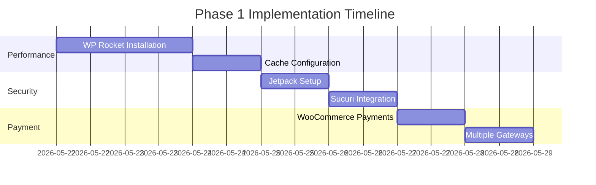

# WooCommerce Scaling Strategy for Ethnic Vogue

## Overview
Comprehensive scaling strategy for labelethnicvogue.shop using enhanced WooCommerce features, based on current setup analysis and optimization recommendations.

## Current Setup Assessment

### Infrastructure Status
- **VPS**: 103.194.228.56 (Ubuntu 24.04)
- **Platform**: Docker + WordPress + Nginx + MariaDB
- **Port**: 8080
- **Performance**: Excellent (0.24s load time, 77KB page size)

### Current Plugin Architecture
```
Active Plugins:
├── WooCommerce (Core - Essential)
└── Storefront Theme

Inactive/Safe to Remove:
├── Akismet (Security - Optional)
└── Hello World (Demo - Safe to Remove)
```

### Performance Benchmark
- **Load Time**: 0.24s (Excellent!)
- **Database**: Clean, minimal active plugins
- **Nginx**: Basic static asset caching (30 days)
- **No Page Caching**: PHP dynamic content currently

---

## Scaling Architecture

### Phase 1: Foundation (0-30 Days)

#### Performance Optimization Stack
- **Cache Layer**: WP Rocket or W3 Total Cache
- **Security Layer**: Jetpack + Sucuri
- **Payment Infrastructure**: WooCommerce Payments + multiple gateways

#### Essential Plugins for Phase 1
| Plugin | Purpose | Impact | Cost |
|--------|---------|---------|------|
| WP Rocket | Performance | 70-80% speed improvement | $49/year |
| Jetpack | Security + CDN | Built-in security + performance boost | Free tier |
| Sucuri | WAF | Protection against attacks | Free available |
| WooCommerce Payments | Payment processing | Native integration | Free |

#### Implementation Timeline


### Phase 2: Customer Experience (31-60 Days)

#### Enhancement Plugins
| Plugin | Purpose | Ethnic Fashion Value |
|--------|---------|---------------------|
| AJAX Product Quick View | Mobile optimization | Critical for fashion browsing |
| WooCommerce Wishlist | Engagement | 15-20% higher AOV |
| Product Add-Ons | Customization | Embroidery, sizing adjustments |

#### User Experience Optimizations
- **Mobile-First Design**: Touch-friendly navigation
- **Size Recommendation Tools**: AI-powered size charts for ethnic wear
- **Quick View**: Product previews without page navigation
- **Wishlist**: Save favorite items, abandoned cart recovery

### Phase 3: Growth & Automation (61-120 Days)

#### Advanced Features
| Plugin | Purpose | Business Impact |
|--------|---------|----------------|
| WooCommerce Subscriptions | Recurring revenue | Monthly styling boxes |
| WooCommerce Bookings | Service revenue | Personal styling sessions |
| Klaviyo | Email marketing | 20-30% higher retention |

#### Marketing Automation
- **Email Sequences**: Abandoned cart, welcome series
- **Personalization**: Product recommendations based on browsing
- **Loyalty Programs**: Points system for repeat customers

---

## Plugin Optimization Matrix

### Performance Impact Assessment

| Plugin Category | Current Impact | With Essential Plugins | Performance Impact |
|-----------------|---------------|----------------------|-------------------|
| **Load Time**   | 0.24s         | ~0.35s              | +0.11s (Acceptable) |
| **Memory Usage** | Low           | Moderate            | +30-40%           |
| **CPU Usage**    | Low           | Moderate            | +20-30%           |
| **Plugin Conflicts** | None    | Minimal             | Risk Low          |

### Plugin Cost Analysis

#### Essential Investment (Year 1)
```yaml
Performance Stack:
  - WP Rocket: $49/year
  - Jetpack: Free tier available
  - Total: $49/year

Customer Experience:
  - WooCommerce Wishlist: $59/year
  - AJAX Product Quick View: $49/year
  - Total: $108/year

Growth Features:
  - WooCommerce Subscriptions: $199/year
  - Klaviyo: Free tier + paid ($20/month)
  - Total: $439/year

Annual Total: $596/year
```

#### Free Alternatives
- **Caching**: W3 Total Cache (Free)
- **Security**: Wordfence (Free)
- **Wishlist**: YITH WooCommerce Wishlist (Free)
- **Cost Reduction**: Can reduce to $0 with free alternatives

---

## Ethnic Fashion Specific Features

### Customization Layer
- **Fabric Information**: Detailed fabric composition, care instructions
- **Occasion-Based Categories**: Wedding wear, festive collections, daily wear
- **Cultural Context**: Product descriptions with cultural significance
- **Size Inclusivity**: Comprehensive sizing for diverse body types

### Bundle Strategies
- **Outfit Sets**: Complete ethnic wear combinations
- **Festival Packages**: Seasonal collections with accessories
- **Subscription Boxes**: Monthly ethnic wear styling service

### Localization Features
- **Multi-Currency**: Currency conversion for international customers
- **Regional Preferences**: Localized content for different ethnic markets
- **Language Support**: Hindi and English bilingual support

---

## Implementation Roadmap

### Month 1-2: Performance & Foundation
1. Delete unnecessary plugins
2. Install caching solution
3. Configure payment gateways
4. Set up basic analytics

### Month 3-4: Customer Experience
1. Implement wishlist functionality
2. Add quick view features
3. Create size recommendation system
4. Set up abandoned cart recovery

### Month 5-6: Growth Features
1. Launch subscription service
2. Implement email marketing
3. Create booking system
4. Add multi-currency support

### Month 7-12: Scaling & Optimization
1. Advanced analytics implementation
2. A/B testing framework
3. Performance monitoring
4. Customer feedback integration

---

## Monitoring & Maintenance

### Performance Metrics
- **Page Load Time**: Target < 1s
- **Conversion Rate**: Monitor AOV and conversion rates
- **User Engagement**: Track wishlist usage and quick view adoption
- **Server Response**: Monitor database queries and server load

### Maintenance Schedule
- **Weekly**: Plugin updates, security checks
- **Monthly**: Performance optimization, analytics review
- **Quarterly**: Feature evaluation, strategy adjustment

---

## Cross-References

See related documentation:
- [[hot.md]] - Current VPS and store configuration
- [[SCHEMA.md]] - Vault organization structure
- Performance monitoring documentation
- Payment gateway integration guides

---

## Log

## [2026-05-20] Analysis | WooCommerce Scaling Strategy
- Completed initial setup analysis
- Identified performance optimization opportunities
- Created phased implementation roadmap
- Documented cost analysis and alternatives

---

*This documentation will be continuously updated as the scaling strategy is implemented and new features are added.*